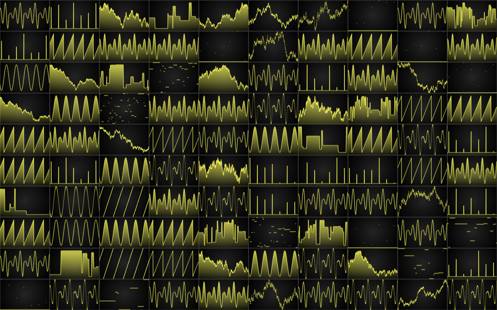

# JavaScript Real-Time Multi Chart Dashboard

This demo application belongs to the set of examples for LightningChart JS, data visualization library for JavaScript.

LightningChart JS is entirely GPU accelerated and performance optimized charting library for presenting massive amounts of data. It offers an easy way of creating sophisticated and interactive charts and adding them to your website or web application.

The demo can be used as an example or a seed project. Local execution requires the following steps:

-   Make sure that relevant version of [Node.js](https://nodejs.org/en/download/) is installed
-   Open the project folder in a terminal:

          npm install              # fetches dependencies
          npm start                # builds an application and starts the development server

-   The application is available at _http://localhost:8080_ in your browser, webpack-dev-server provides hot reload functionality.

## Description

Showcase of 100 different LightningChart visuals all in one scene as completely individual components.

Each channel is receiving streaming data in real-time and displaying it as fast as possible.

While in this example the layout looks like a inflexible grid where every chart has the same size, this is technically not the case.
In technical terms every chart is a completely independent component, which could be dragged around, resized, removed, added in, etc. at any point in time.

Details:

-   Number of charts: 100
-   Stream rate per channel: 60 points per second
-   Time window: 10 seconds
-   Total data points displayed at any given time: 600 000
-   Total data points streamed every second: 6 000
-   Refresh rate: 60 times per second\*

\*Depends on monitor, usually with PC monitors / laptops capped at 60 Hz. Mobile devices / laptops sometimes have higher refresh rates.
Additionally on weak hardware update rate can drop, generally due to weaker GPU.

## API Links

* [Dashboard]
* [XY cartesian chart]
* [Line series]
* [Axis]
* [Axis tick strategies]
* [Axis scroll strategies]

## Support

If you notice an error in the example code, please open an issue on [GitHub][0] repository of the entire example.

Official [API documentation][1] can be found on [LightningChart][2] website.

If the docs and other materials do not solve your problem as well as implementation help is needed, ask on [StackOverflow][3] (tagged lightningchart).

If you think you found a bug in the LightningChart JavaScript library, please contact sales@lightningchart.com.

Direct developer email support can be purchased through a [Support Plan][4] or by contacting sales@lightningchart.com.

[0]: https://github.com/Arction/
[1]: https://lightningchart.com/lightningchart-js-api-documentation/
[2]: https://lightningchart.com
[3]: https://stackoverflow.com/questions/tagged/lightningchart
[4]: https://lightningchart.com/support-services/

© LightningChart Ltd 2009-2022. All rights reserved.

[Dashboard]: https://lightningchart.com/js-charts/api-documentation/v8.0.0/classes/Dashboard.html
[XY cartesian chart]: https://lightningchart.com/js-charts/api-documentation/v8.0.0/classes/ChartXY.html
[Line series]: https://lightningchart.com/js-charts/api-documentation/v8.0.0/
[Axis]: https://lightningchart.com/js-charts/api-documentation/v8.0.0/classes/Axis.html
[Axis tick strategies]: https://lightningchart.com/js-charts/api-documentation/v8.0.0/variables/AxisTickStrategies.html
[Axis scroll strategies]: https://lightningchart.com/js-charts/api-documentation/v8.0.0/variables/AxisScrollStrategies.html

